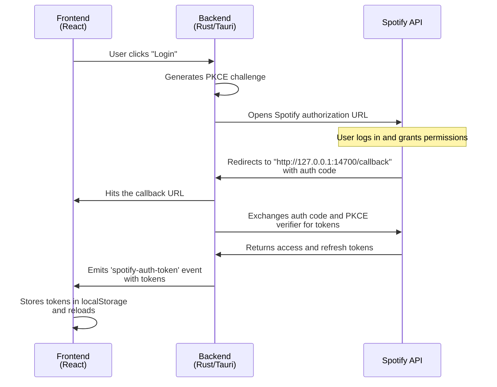
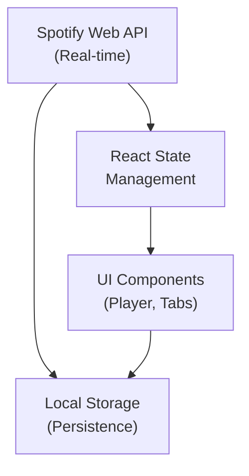
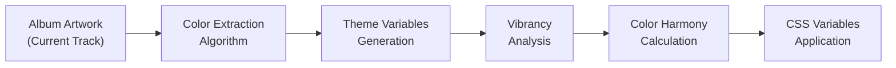

# Spotify Desktop Widget

A modern, cross-platform desktop widget for Spotify that provides seamless music control with advanced features and customizable theming.

## Table of Contents

- [Overview](#overview)
- [Features](#features)
- [Installation](#installation)
- [Configuration](#configuration)
- [Usage](#usage)
- [Architecture](#architecture)
- [Authentication Flow](#authentication-flow)
- [Application Flow](#application-flow)
- [Development](#development)
- [Roadmap](#roadmap)
- [Contributing](#contributing)
- [License](#license)

## Overview

The Spotify Desktop Widget is a lightweight, feature-rich application built with Tauri, React, and TypeScript. It provides a native desktop experience for controlling Spotify playback while offering advanced functionality beyond basic media controls.

### Key Highlights

- **Ultra-compact design** with dynamic vertical sizing (35-140px height)
- **Cross-platform compatibility** (Windows, macOS, Linux)
- **Real-time synchronization** with Spotify's playback state
- **Advanced theming system** with automatic color extraction from album artwork
- **Local file support** with custom album art detection
- **Comprehensive settings management** with persistent configuration

## Features

### Core Functionality

- **Playback Control**: Play, pause, skip, previous, shuffle, repeat
- **Volume Management**: Precise volume control with visual feedback
- **Progress Tracking**: Interactive progress bar with seek functionality
- **Device Management**: Switch between available Spotify devices

### Advanced Features

- **Multi-tab Interface**: Recently played, playlists, search, and device management
- **Smart Theming**: Automatic color extraction and theme generation from album artwork
- **Compact Modes**: Ultra-compact and mini player modes for minimal screen usage
- **Local File Integration**: Automatic detection and display of local music file album art
- **Sleep Timer**: Configurable auto-pause functionality (15 minutes to 2 hours)
- **Settings Management**: Comprehensive configuration with persistent storage

### User Interface

- **Responsive Design**: Adapts to different screen sizes and orientations
- **Dynamic Sizing**: Intelligent vertical compression when tabs are hidden
- **Visual Feedback**: Smooth animations and hover effects
- **Accessibility**: Keyboard navigation and screen reader support

## Installation

### Prerequisites

- Node.js (v18 or later)
- Rust and Cargo
- Spotify account (Free or Premium)

### Setup Process

1. **Clone the repository**
   ```bash
   git clone https://github.com/hld19/spotify-widget.git
   cd spotify-widget
   ```

2. **Install dependencies**
   ```bash
   npm install
   ```

3. **Configure Spotify API**
   - Visit the [Spotify Developer Dashboard](https://developer.spotify.com/dashboard/)
   - Create a new application with these settings:
     - **App name**: "Spotify Desktop Widget" (or your preferred name)
     - **App description**: "Desktop widget for Spotify control"
     - **Redirect URI**: `http://127.0.0.1:14700/callback`
     - **APIs used**: Web Playback SDK, Web API
   - Copy your **Client ID** from the app dashboard

4. **Set your Client ID**
   
   **Method A: Using .env file (Recommended)**
   - Copy `.env.example` to `.env`:
     ```bash
     cp .env.example .env
     ```
   - Edit `.env` and replace `your_spotify_client_id_here` with your actual Client ID:
     ```
     VITE_SPOTIFY_CLIENT_ID=your_actual_client_id_here
     ```
   
   **Method B: Direct code edit**
   - download the application here https://github.com/hld19/spotify-widget/releases/tag/spotify

5. **Launch the application**
   ```cmd
   npm run tauri dev
   ```

## Configuration

### Application Settings

The widget offers extensive customization options:

- **View Modes**: Mini mode, transparent mode, compact mode
- **Theme Settings**: 5 preset themes plus custom color configuration
- **Audio Settings**: Crossfade, normalization, gapless playback
- **Local Files**: Custom music directory specification for album art detection
- **Sleep Timer**: Configurable auto-pause intervals

### Handling Exposed Client IDs

If you accidentally committed your Client ID to Git:

1. **Regenerate your Client ID** in the Spotify Developer Dashboard
2. **Clean Git history** (advanced users only):
   ```bash
   git filter-branch --force --index-filter \
   'git rm --cached --ignore-unmatch src/api/spotify.ts' \
   --prune-empty --tag-name-filter cat -- --all
   ```
3. **Accept it**: Client IDs are not considered secret and exposure is generally acceptable

## Usage

### Initial Setup

1. Launch the application
2. Click "Login with Spotify" when prompted
3. Authorize the application in your browser
4. Return to the widget to begin using it

### Basic Controls

- **Play/Pause**: Click the play button or use spacebar
- **Skip Tracks**: Use next/previous buttons or arrow keys
- **Volume Control**: Adjust using the volume slider
- **Progress Seeking**: Click anywhere on the progress bar

### Advanced Features

- **Tab Navigation**: Access different views (Recent, Playlists, Search, Devices)
- **Theme Customization**: Automatic theme generation from album artwork
- **Settings Access**: Click the gear icon to open comprehensive settings
- **Local File Support**: Specify your music directory for enhanced album art

### Keyboard Shortcuts

#### Global Hotkeys (work when app is not focused)
- `Ctrl+Shift+←` - Previous track
- `Ctrl+Shift+→` - Next track
- `Ctrl+Shift+Q` - Quit application

#### In-App Shortcuts
- `Space` - Play/Pause
- `←/→` - Skip tracks
- `↑/↓` - Volume control

### Window Management

- **Always on Top**: Keep widget above other windows
- **Taskbar Integration**: Show/hide from Windows taskbar
- **Dynamic Resizing**: Automatic size adjustment based on tab visibility

## Architecture

### Technology Stack

- **Frontend**: React 18, TypeScript, TailwindCSS
- **Backend**: Rust with Tauri framework
- **Authentication**: OAuth 2.0 with PKCE
- **State Management**: React hooks with localStorage persistence
- **API Integration**: Spotify Web API with real-time polling

### Project Structure

```
spotify-desktop-widget/
├── src/                          # Frontend source code
│   ├── api/
│   │   └── spotify.ts           # Spotify API client
│   ├── components/              # React components
│   │   ├── Player.tsx          # Main player interface
│   │   ├── Settings.tsx        # Configuration panel
│   │   ├── ProgressBar.tsx     # Progress control
│   │   └── [other components]
│   ├── hooks/                   # Custom React hooks
│   │   ├── useSpotify.ts       # Spotify state management
│   │   ├── useTheme.ts         # Theme management
│   │   └── [other hooks]
│   ├── contexts/               # React contexts
│   └── main.tsx               # Application entry point
├── src-tauri/                  # Backend source code
│   ├── src/
│   │   ├── main.rs            # Rust backend logic
│   │   └── lib.rs             # Library functions
│   ├── Cargo.toml             # Rust dependencies
│   └── tauri.conf.json        # Tauri configuration
├── package.json               # Node.js dependencies
└── README.md                  # Documentation
```

### Core Components

- **Player**: Main interface with tab navigation and media controls
- **Settings**: Comprehensive configuration management
- **ProgressBar**: Interactive progress control with seek functionality
- **AudioSettings**: Advanced audio configuration options
- **ThemeCustomizer**: Dynamic theme generation and customization

## Authentication Flow

The application uses OAuth 2.0 with PKCE (Proof Key for Code Exchange) for secure authentication with Spotify:



### Authentication Process Details

1. **User Initiation**: User clicks "Login with Spotify" in the frontend
2. **PKCE Challenge**: Backend generates PKCE challenge and opens Spotify authorization URL
3. **User Authorization**: User logs in and grants permissions in browser
4. **Callback Handling**: Spotify redirects to callback URL with authorization code
5. **Token Exchange**: Backend exchanges auth code and PKCE verifier for tokens
6. **Token Storage**: Frontend stores tokens in localStorage and reloads application

## Application Flow

### Data Flow Architecture



### Theme Generation Process



## Development

### Prerequisites

- Node.js 18+
- Rust 1.70+
- Tauri CLI: `cargo install tauri-cli`

### Development Commands

```bash
# Install dependencies
npm install

# Start development server
npm run tauri dev

# Build for production
npm run tauri build

# Run tests
npm run test

# Lint code
npm run lint
```

### Building for Different Platforms

#### Windows
```bash
# Prerequisites
# - Visual Studio Build Tools or Visual Studio Community
# - Windows 10 SDK

npm run tauri build
```

#### macOS
```bash
# Prerequisites
# - Xcode Command Line Tools: xcode-select --install

npm run tauri build
```

#### Linux
```bash
# Prerequisites (Ubuntu/Debian)
sudo apt update
sudo apt install libwebkit2gtk-4.0-dev build-essential curl wget libssl-dev libgtk-3-dev libayatana-appindicator3-dev librsvg2-dev

# Prerequisites (Fedora)
sudo dnf install webkit2gtk3-devel openssl-devel curl wget libappindicator-gtk3-devel librsvg2-devel
sudo dnf group install "C Development Tools and Libraries"

npm run tauri build
```

### Code Structure Guidelines

- **Components**: Functional components with TypeScript
- **Hooks**: Custom hooks for state management and side effects
- **Styling**: TailwindCSS with responsive design principles
- **Error Handling**: Comprehensive error boundaries and user feedback
- **Performance**: Optimized rendering with React.memo and useMemo

## Roadmap

### Phase 1: Core Stability (Completed)
- [x] Basic playback controls
- [x] Spotify API integration
- [x] OAuth 2.0 authentication
- [x] Cross-platform compatibility
- [x] Basic theming system

### Phase 2: Enhanced UI/UX (Completed)
- [x] Multi-tab interface
- [x] Dynamic theme generation
- [x] Responsive design implementation
- [x] Settings management system
- [x] Local file album art support

### Phase 3: Advanced Features (In Progress)
- [ ] Lyrics integration
- [ ] Podcast controls enhancement
- [ ] Keyboard shortcuts system
- [ ] Gesture controls
- [ ] Queue management

### Phase 4: Smart Features (Planned)
- [ ] AI-powered recommendations
- [ ] Smart home integration
- [ ] Voice command support
- [ ] Collaborative listening sessions
- [ ] Advanced statistics and analytics

### Phase 5: Professional Features (Future)
- [ ] Plugin system architecture
- [ ] Custom widget themes marketplace
- [ ] Cloud synchronization
- [ ] Multi-account support
- [ ] Enterprise deployment options

### Technical Improvements (Ongoing)
- [ ] Performance optimization
- [ ] Memory usage reduction
- [ ] Startup time improvement
- [ ] Error handling enhancement
- [ ] Accessibility compliance (WCAG 2.1)

## Contributing

We welcome contributions from the community. Please read our contributing guidelines before submitting pull requests.

### Development Process

1. Fork the repository
2. Create a feature branch
3. Implement your changes
4. Add tests for new functionality
5. Submit a pull request

### Code Standards

- Follow TypeScript best practices
- Use TailwindCSS for styling
- Implement comprehensive error handling
- Write clear, self-documenting code
- Include unit tests for new features

## License

This project is licensed under the MIT License. See the [LICENSE](LICENSE) file for details.

---

**Built with React, TypeScript, Rust, and Tauri**
