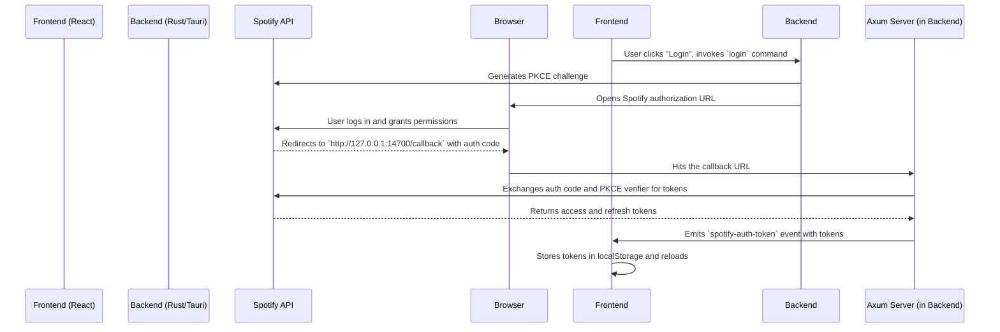

# Spotify Desktop Widget

<div align="center">

**A modern, elegant, and minimalistic Spotify widget for desktop environments.**

*Built with a focus on performance, aesthetics, and a native desktop experience.*

</div>

[Features](#-features) • [Quick Start](#-quick-start) • [Architecture](#️-architecture) • [Performance](#-performance)

---

## Table of Contents

- [Overview](#-overview)
- [Features](#-features)
- [Quick Start](#-quick-start)
- [Configuration](#️-configuration)
- [Architecture](#️-architecture)
- [Performance](#-performance)
- [Troubleshooting](#-troubleshooting)
- [License](#-license)

---

## Overview

This project is a floating desktop widget for controlling Spotify playback. It provides a beautiful and unobtrusive interface that lets you manage your music without needing the full Spotify application open.

The widget is built using Tauri, React, and TypeScript, resulting in a lightweight, secure, and cross-platform application that feels native on Windows, macOS, and Linux. It features a transparent, glassmorphism-style UI with both light and dark modes, responsive layouts for collapsed and expanded views, and smooth animations.

## Features

### UI and UX

- **Floating, Transparent Window**: A borderless, always-on-top window that blends with your desktop.
- **Glassmorphism Design**: Frosted glass effect for a modern aesthetic.
- **Light and Dark Modes**: A theme system that respects your system settings or can be set manually.
- **Adaptive Layout**: The widget dynamically resizes between expanded and collapsed views with smooth animations.
- **Draggable Interface**: The entire widget can be moved anywhere on the screen.
- **Native Feel**: Designed to feel like an integrated part of the desktop environment.

### Spotify Integration

- **Real-time Playback Sync**: Displays the currently playing track or podcast with updated progress.
- **Full Playback Controls**: Play, pause, next, previous, and a draggable seek bar.
- **Secure Authentication**: Utilizes the secure OAuth 2.0 PKCE flow to connect to your Spotify account.
- **Automatic Token Refresh**: The session stays active in the background without requiring repeated logins.

### Desktop Experience

- **Cross-Platform**: A single codebase that runs on Windows, macOS, and Linux.
- **Low Resource Usage**: Built with Rust and webviews for a minimal memory and CPU footprint compared to Electron-based apps.
- **Global Hotkeys**: Control playback (next/previous) and close the app from anywhere in the OS.

---

## Quick Start

### Prerequisites

- **Node.js** (v18 or later)
- **Rust** and the Cargo package manager
- A **Spotify Account** (Free or Premium)

### 1. Installation

```bash
# Clone the repository
git clone https://github.com/your-username/spotify-widget.git
cd spotify-widget

# Install frontend dependencies
npm install
```

### 2. Configuration

This application requires a Spotify Developer App to communicate with the API.

1.  Go to the [Spotify Developer Dashboard](https://developer.spotify.com/dashboard/) and log in.
2.  Click `Create App`.
3.  Give your app a name and description (e.g., "Tauri Widget").
4.  Once created, find your **Client ID** and copy it.
5.  Go to `App settings` for the app you just created.
6.  In the `Redirect URIs` field, add the following URL exactly: `http://127.0.0.1:14700/callback`
7.  Save the settings.

Now, open the project in your code editor and update the backend with your Client ID.

- **File**: `spotify-widget/src-tauri/src/main.rs`
- **Line to edit**: Find the `CLIENT_ID` constant and replace the placeholder value with your own Client ID.

```rust
// spotify-widget/src-tauri/src/main.rs

const CLIENT_ID: &str = "YOUR_CLIENT_ID_HERE"; 
```

### 3. Launch

```bash
# Start the application in development mode
npm run tauri dev
```

The app will start, and you will be prompted to log in with Spotify.

---

## Architecture

### Project Structure

```
spotify-widget/
├── src/                      # Frontend source code (React, TypeScript)
│   ├── api/
│   │   └── spotify.ts        # Frontend API client for Spotify
│   ├── components/           # React components (Player, ProgressBar, etc.)
│   ├── hooks/                # Custom React hooks (useSpotify, useTheme)
│   ├── App.tsx               # Main application component with routing
│   └── main.tsx              # Frontend entry point
├── src-tauri/                # Backend source code (Rust)
│   ├── src/
│   │   └── main.rs           # Main Rust application logic
│   └── tauri.conf.json       # Tauri configuration file
├── index.html                # HTML entry point
├── package.json              # Frontend dependencies and scripts
└── README.md                 # This file
```

### Authentication Flow

The application uses the **OAuth 2.0 Authorization Code Flow with PKCE**, which is a secure method for native applications to obtain access tokens.

The entire authentication process is orchestrated between the Rust backend and the frontend, ensuring that no sensitive secrets are stored on the client-side.



---

## Performance

### State Synchronization Delay

To keep the player state synchronized with Spotify, the application polls the Spotify API.

-   **Polling Interval**: The `useSpotify` hook fetches the current playback state every **3 seconds**.
-   **Real-time Feedback**: Actions performed within the widget (e.g., play, pause, seek) trigger an immediate state refetch to provide instant UI feedback, followed by the resumption of the regular polling cycle.

This polling strategy balances near real-time updates with efficient use of network resources and adherence to Spotify's API rate limits.

### UI Responsiveness

-   **Tauri Framework**: By using the system's native webview and a Rust backend, the application has a significantly lower memory footprint and faster startup time than Electron-based alternatives.
-   **Optimized Rendering**: The UI is built with React and styled with Tailwind CSS, ensuring efficient rendering and a consistently smooth experience, even during animations and layout changes.
-   **Minimal Re-renders**: Custom hooks are used to manage state, ensuring that only the necessary components re-render when the player state changes.

---

## Troubleshooting

### Common Issues

-   **Application compiles but the window is blank or shows an error.**
    -   Ensure you have run `npm install`.
    -   Verify that the `npm run tauri dev` command completes without errors in the terminal.

-   **Login with Spotify button does not work.**
    -   Make sure you have correctly set your `CLIENT_ID` in `src-tauri/src/main.rs`.
    -   Verify that the `Redirect URI` in your Spotify Developer Dashboard is set *exactly* to `http://127.0.0.1:14700/callback`. Any deviation, including a trailing slash, will cause it to fail.

-   **Stuck on "Loading..." or "Nothing is playing" after login.**
    -   Make sure you have Spotify open and are actively playing a track on a device. The widget can only control and display an active session.
    -   Check your internet connection.

### Debugging

You can view the webview's developer console by right-clicking inside the widget and selecting `Inspect`. This is useful for diagnosing frontend errors or inspecting network requests.

---

## License

This project is licensed under the MIT License. See the `LICENSE` file for details.
